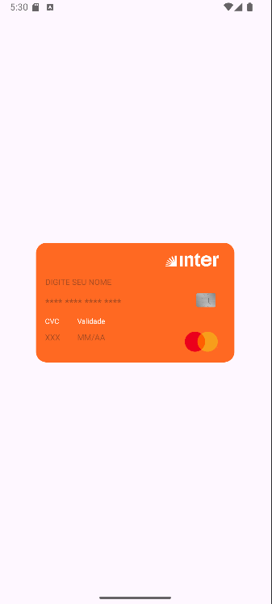

<h1 align="center">Credit Card App 💳 </h1>

## Project 

Mobile Programming: This Android app was developed to simulate credit card data entry with real-time validation and an intuitive design. The card layout emulates the Brazilian digital bank Inter. 

## Layout 

  <table style="border-collapse: collapse; margin: 10px;">
    <tr>
      <td style="padding: 10px; text-align: center;">
        
      </td>
      <td style="padding: 10px; text-align: center;">
        
      </td>
    </tr>
  </table>

## Technologies Used 

- **Programming Language:** Kotlin
- **Development Environment:** Android Studio
